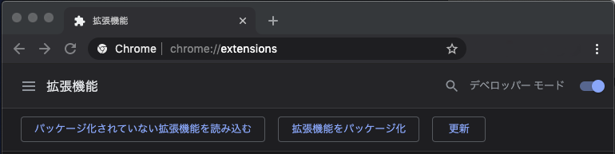

# CodeNoCall
Ready for machine translation except source code

# ソースコードは翻訳しないで

[Google翻訳](https://translate.google.com)、便利ですよね。最新の技術文書は英語で配信されることが多いですし、たとえ英語が読めたとしても、やはり母国語のほうが読む速度が速い。Chromeブラウザに[Google翻訳の拡張機能](https://chrome.google.com/webstore/search/translate?_feature=google)を追加すれば、ボタン一つで翻訳されます。しかし、気になることが。文書中のソースコードまで翻訳されて読みづらい。なんとかならないのか。

実は、htmlのタグのクラスに以下のように"notranslate"と記載するとその部分は翻訳されません。

```html
<span class="notranslate">cd library</span>
```
これは、配信元がGoogle翻訳を使って自らの情報を多言語で配信したいときに、翻訳されて欲しくない部分を指定するために設けられた機能のようです。しかし、全てのページのソースコード部分にそのような配慮を期待することはできません。

そこで、Chrome拡張を使ってこの問題を解決しましょう。Chrome拡張にはページを読み込んだ際にコードを実行する機能があります。これを用いてソースコードらしき記述に対して上記のnotranslateを付与します。

## Chrome拡張のファイル構成
Chrome拡張を作成するのは非常に簡単です。作業用のディレクトリを作ってその中に二つのファイルを作成するだけです。ディレクトリの名前をnotranslateとすると以下のファイル構成になります。

```
notranslate/
├── content.js
└── manifest.json
```
manifest.jsonのファイル名は固定です。content.jsのファイル名は任意で、manifest.jsonの中で指定します。

## manifest.jsonの内容
```json
{
  "manifest_version": 2,
  "name": "notranslate",
  "version": "1.0",
  "description": "Stop translating code text",
  "content_scripts": [
    {"matches":[ "http://*/*", "https://*/*" ],
     "all_frames": true,
     "js":["content.js"]
    }
  ]
}
```
重要なのは"content_scripts"の内容です。これによって、ページが読み込まれた際に実行されるタスクの情報を指定します。

| key | 説明 |
|:---:|:---|
| matches | タスクを実行する対象のページのURLがマッチするパターンを指定します。複数のパターンを指定できます。|
| all_frames | (true or false) 入れ子のフレームに対してもタスクを実行するか否か。 |
| js | 実行するタスクをJavascriptで記述したファイル名。複数のファイルを指定できます。 |

"matches"でタスクを実行するページを指定できます。今回は全てのページに対して実行するので上記の記述になっています。
また、入れ子のフレームの全てに対して実行するので、"all_frames"はtrueです。
さらに"js"に対して"content.js"を指定しています。

## 基本的なcontent.jsの内容
まずは本質的な部分に絞ったものを示します。基本的には以下のみで動作します。これは、`<PRE></PRE>`および`<CODE></CODE>`の内部のテキスト要素を`<SPAN class="notranslate"></SPAN>`で囲みます。

```javascript
function addNotranslate(target) {                      // 1
    for (let node of target.children) {                // 2
        if (["PRE", "CODE"].includes(node.nodeName)) { // 3
            allNotranslate(node)                       // 4
        }
        else addNotranslate(node)                      // 5
    }
}

function allNotranslate(target) {                      // 6
    for (let node of target.childNodes) {              // 7
        if (node.nodeName == "#text") {                // 8
            let c = document.createElement("SPAN")     // 9
            c.textContent = node.data                  // 10
            c.classList.add("notranslate")             // 11
            node.replaceWith(c)                        // 12
        }
        allNotranslate(node)                           // 13
    }
}

addNotranslate(document.firstElementChild)             // 14
```

1. 引数`target`の子要素に対して再帰的に処理してPRE要素およびCODE要素を見つけ、`allNotranslate()`を適用する関数です。
2. `target`の子要素を変数`node`に代入して処理を繰り返します。`target.children`は`target`のタグ要素を返しますが、テキスト要素は含まれません。
3. `node`がPRE要素もしくはCODE要素であることを判定します。
4. 引数`node`配下の全てのテキスト要素に`class="notranslate"`を付与する処理を呼び出します。
5. `<PRE>`または`<CODE>`以外の要素に対して、`addNotranslate()`を再帰的に呼び出します。
6. 引数`target`の子要素に対して再帰的に処理して、テキスト要素を`<SPAN class="notranslate">`で囲う関数です。
7. `target`の子要素を順次`node`に代入して処理を繰り返します。`target.childNodes`は`target`のタグ要素およびテキスト要素を返します。
8. `node.nodeName`がテキスト要素であることを判定します。
9. SPAN要素を作成します。
10. SPAN要素のテキスト属性にテキスト要素のテキスト属性を代入します。
11. SPAN要素のクラスに`"notranslate"`を追加します。
12. テキスト要素をSPAN要素に置換します。
13. 再帰的に`target`の子要素に対してallNotranslate()を適用します。
14. ドキュメントの最上位の要素である`document.firstElementChild`を引数としてaddNotranslate()を呼び出します。各ページに対し、これが最初に実行されます。

## Chrome拡張をchromeで有効化する
Chromeの右上の設定ボタン「⋮」から「その他のツール／拡張機能」を選びます。すると下図のようになるので、右側のデベロッパーモードをONにして、「パッケージ化されていない拡張機能を読み込む」をクリックし、作業用のディレクトリ(notranslate)を選べば、拡張機能が有効化します。ソースコードが含まれるような英語のページを表示させてGoogle翻訳させてみてください。




## その他のソースコードらしき部分への対応
上手くソースコード部分の翻訳が避けられましたか？もしかしたら失敗しているかもしれません。というのも、ソースコードだからといって`<PRE>`や`<CODE>`で囲われているとは限らないからです。いくつかのサイトを確認したところ、ソースコードを記述する箇所に独自のstyleを指定しており、多くの場合、そのclassの名前に"code"が含まれていました。ただ、"block"や"container"なども含まれているとソースコード以外の外側の部分も含まれていて悪さをします。などなどのヒューリスティクスを入れ込んだ結果、`addNotranslate()`は以下になりました。GitHubのReadme.mdなど概ねこれで上手く行きます。

```javascript
var notranslateName = ['PRE', 'CODE', 'FIGURE', 'SOURCE']

function addNotranslate(target = document.firstElementChild) {
    for (let node of target.children) {
        let nodeName = String(node.nodeName)
        if (notranslateName.includes(nodeName)
            || nodeName.search('COMMAND') >= 0
            || nodeName.search('CODE') >= 0) {
            allNotranslate(node)
            continue
        }
        else if (node.className != undefined) {
            let className = String(node.className)
            if (className.search("shell") >= 0
                || (className.search("code") >= 0
                    && className.search("block") < 0
                    && className.search("container") < 0
                )) {
                allNotranslate(node)
                continue
            }
        }
        addNotranslate(node)
    }
}
```

## 非同期で読み込まれるフレームへの対応
いろいろテストしてみると、フレームが非同期にロードされる仕組みのページに対して上手く機能しない場合がありました。そこで最終行のコマンドを時間差で実行するようにしました。時間差での実行には`setTimeout()`を使います。対処としては完璧ではありませんが、実用上は問題なさそうです。

```javascript
setTimeout(addNotranslate, 1000, document.firstElementChild)
```

## Google翻訳の即時翻訳オプションへの対応
非同期に対処して一件落着かと思いきや、まだ問題がありました。Chromeの設定で常に翻訳するというオプションがあり、これに設定すると時間差でのnotranslateの処理が始まる前に翻訳が行われてしまいます。そこで、冗長ですが、以下のように対処しました。

```javascript
addNotranslate(document.firstElementChild)
setTimeout(addNotranslate, 1000, document.firstElementChild)
```

## ソースコードのコメントは翻訳して欲しい
初期の要望は概ね満たせましたが、ソースコードの中のコメントは翻訳したいという欲が。これまたアドホックですが、`allNotranslate()`を以下にすることで概ねできました。テキスト要素がコメントっぽい始まりの場合に"notranslate"を付与しないようにしています。また、"#text"を`<span>`で囲うと副作用がある場合があるので、単純な場合には親ノードに"notranslate"を付与するようにしました。

```javascript
function allNotranslate(target) {
    for (let node of target.childNodes) {
        let text = node.textContent
        if (text != undefined && text.length > 0) {
            let nodeName = String(node.nodeName)
            if (["SPAN", "#text", "CODE", "PRE"].includes(nodeName)) {
                if (!text.includes("\n") && (text.startsWith('//') || text.startsWith('#'))
                    || text.startsWith('/*') && text.endsWith('*/')
                ) continue
            }
            if (nodeName == "#text") {
                if (target.childElementCount == 0) {
                    target.classList.add("notranslate")
                }
                else {
                    let c = document.createElement("span")
                    c.textContent = node.data
                    c.classList.add("notranslate")
                    node.replaceWith(c)
                }
            }
        }
        allNotranslate(node)
    }
}
```

## 最終的なcontent.js
最終的なcontent.jsの内容を以下に示します。ここで、この拡張機能はページを読み込む度に実行されるため、処理速度も重要になってきます。そのため、テールリカージョンを排除するようにしてあります。

```javascript
function allNotranslate(target) {
    if ("notranslate" in target.classList.values()) return
    for (let node of target.childNodes) {
        let text = node.textContent
        if (text != undefined && text.length > 0) {
            let nodeName = String(node.nodeName)
            if (["SPAN", "#text", "CODE", "PRE"].includes(nodeName)) {
                if (!text.includes("\n") && (text.startsWith('//') || text.startsWith('#'))
                    || text.startsWith('/*') && text.endsWith('*/')
                ) continue
            }
            if (nodeName == "#text") {
                if (target.childElementCount == 0) {
                    target.classList.add("notranslate")
                }
                else {
                    let c = document.createElement("span")
                    c.textContent = node.data
                    c.classList.add("notranslate")
                    node.replaceWith(c)
                }
            }
        }
        if (node.hasChildNodes()) allNotranslate(node)
    }
}

var notranslateName = [
    'PRE', 'CODE', 'FIGURE', 'SOURCE'
]

function addNotranslate(target) {
    for (let node of target.children) {
        let nodeName = String(node.nodeName)
        if (notranslateName.includes(nodeName)
            || nodeName.search('COMMAND') >= 0
            || nodeName.search('CODE') >= 0) {
            // node.classList.add("notranslate")
            allNotranslate(node)
            continue
        }
        else if (node.className != undefined) {
            let className = String(node.className)
            if (className.search("shell") >= 0
                || (className.search("code") >= 0
                    && className.search("block") < 0
                    && className.search("container") < 0
                )) {
                allNotranslate(node)
                continue
            }
        }
        if (node.hasChildNodes()) addNotranslate(node)
    }
}

addNotranslate(document.firstElementChild)
setTimeout(addNotranslate, 1000, document.firstElementChild)
```

## あとがき
手前味噌ですが、このChrome拡張を使用し始めたらもう手放せません。機械翻訳された技術文書を読む際にソースコード部分に翻訳が混じるのがこれほどストレスだったとは当初は気がついていませんでした。
ここ([notranslate](https://chrome.google.com/webstore/search/notranslate))にこの拡張機能を登録しておきました。よろしければご使用ください。
